# 🤖 Lunch Money MCP — Master Agent Hand-off Technical Specification

## 📋 Executive Overview & Purpose

This document is an **exhaustive hand-off guide** for AI coding agents and human engineers maintaining **Lunch Money MCP**. It records architectural conventions and the completed implementation history through Sprint 7, when the Lunch Money v2 API coverage matrix was completed.

---

## 🏛️ System Architectural Principles & Conventions

### 1. Codebase Architecture & Layering Rules

- **Services Layer (`src/lunchmoney_mcp/services/`)**: All business logic, DB queries, API calls, and domain rollups **must** reside in `services/`.
- **FastAPI Routers (`src/lunchmoney_mcp/app/routers/`)**: Routers must be clean 1-to-2 line delegators calling service functions.
- **FastMCP Server (`src/lunchmoney_mcp/mcp/server.py`)**: FastMCP tools must be clean 1-to-2 line delegators calling the exact same service functions as FastAPI routers. FastMCP tools are explicitly registered via `@mcp.tool()`, so route `operation_id` alignment is decoupled and not required.
- **Upstream-First Mutation Pattern**: All write operations (create/update/delete) **must** call the Lunch Money v2 API first. Upon receiving the canonical API response object, the service converts it to a SQLModel record (`Model.from_api()`) and executes `await db.upsert()` or `await db.delete()`.

### 2. Code Quality & Verification Standard

Before committing any code, any agent **must** execute:

```bash
task fix && task lint && task check && task test
```

All four commands must exit with status `0` and 0 errors.

### 3. Git Commit Conventions

All commits **must** use the Gitmoji convention:

```
<intention> [scope?][:?] <message>
```

---

## 🗺️ Master Sprint Implementation Roadmap

```mermaid
graph LR
    S0[Sprint 0: Incremental ETL & Stateless Engine] --> S1[Sprint 1: Complete Read-Only Coverage]
    S1 --> S2[Sprint 2: Category & Account Mutations]
    S2 --> S3[Sprint 3: Transaction Mutations & Splits]
    S3 --> S4[Sprint 4: Budgets & Spending Trends]
    S4 --> S5[Sprint 5: Production Security & CI/CD]
    S5 --> S6[Sprint 6: Remote MCP OAuth]
    S6 --> S7[Sprint 7: Tag Mutations & v2 Completion]
```



---

## 🛠️ Sprint Specifications

### Sprint 0: Incremental ETL & Stateless Engine

Completed: `SyncMetadata` watermark tracking, opt-in incremental sync (`incremental=True`), configurable safety overlap margins (`LUNCHMONEY_SYNC_SAFETY_MARGIN_MINUTES`), and in-memory SQLite support (`STATELESS=true`).

### Sprint 1: Complete Read-Only 100% v2 API Coverage

Completed: `/summary`, `/tags`, `/recurring_items`, `/categories/{id}`, `/manual_accounts/{id}`, `/plaid_accounts/{id}`, and `/transactions/{id}` read operations.

### Sprint 2: Category & Manual Account Mutations

Completed: `POST`, `PUT`, and `DELETE` for categories and manual accounts using the upstream-first write-back pattern.

### Sprint 3: Transaction Mutations, Grouping, Splitting & Attachments

Completed: single and bulk transaction CRUD, transaction grouping, transaction splitting, and file attachment operations.

### Sprint 4: Budgets & Spending Trends

Completed: `GET /budgets/settings`, `PUT /budgets`, `DELETE /budgets`, and `GET /spending/trends`.

### Sprint 5: Production Security & CI/CD

Completed: REST API-key authorization, the MCP executable with mutually exclusive stdio/SSE/HTTP/Streamable HTTP transports, MCP resources and prompts, and GitHub Actions validation.

### Sprint 6: Remote MCP OAuth & Roadmap Reconciliation

Completed: optional OIDC OAuth protection for remote MCP HTTP transports, OAuth deployment guidance, and roadmap reconciliation.

### Sprint 7: Tag Mutations & API Coverage Completion

Completed: upstream-first tag `POST`, `PUT`, and `DELETE` operations through REST and MCP, including cached transaction-tag link cleanup. The documented Lunch Money v2 API matrix is now complete.
