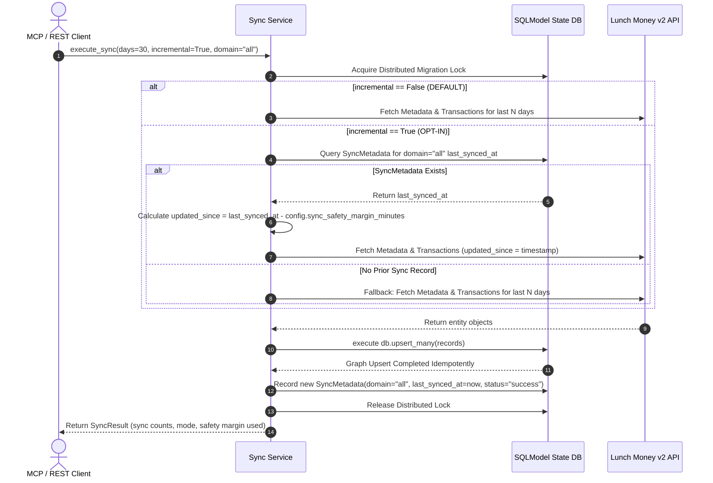

# 🔄 Incremental ETL Architecture & Sync Specification

## 📋 Overview
This document specifies the **Opt-in Incremental ETL Pipeline** for **Lunch Money MCP** using `updated_at` timestamps, domain-specific watermarks, parameterized safety margins, and stateless execution capabilities, while preserving the default rolling calendar date range sync (`days=30`) and persistent SQLite storage.

---

## 🏛️ Directives & Key Design Decisions

> [!IMPORTANT]
> **1. Incremental Sync is Opt-In**:
> - Default behavior for `POST /sync` and `sync_data` FastMCP tool: `incremental: bool = False`.
> - When `incremental=False`: Performs standard rolling date window fetch using `days: int = 30` (or explicit `start_date` / `end_date`).
> - When `incremental=True`: Looks up `SyncMetadata` for the last successful sync timestamp and applies the parameterized safety buffer overlap (`updated_since = last_synced_at - timedelta(minutes=safety_margin)`).

> [!IMPORTANT]
> **2. Parameterized Safety Overlap Window**:
> - Configured via environment variable `LUNCHMONEY_SYNC_SAFETY_MARGIN_MINUTES` in `Settings` (default `5` minutes).

> [!NOTE]
> **3. Upstream-First Mutation Write-Back Strategy**:
> - Mutation operations (creating/updating categories or transactions) execute against the **Lunch Money API first**, then upsert the returned canonical entity into the local database graph.

---

## System Architecture & Flow



---

## 🛠️ Code Specifications

### Configuration (`src/lunchmoney_mcp/config.py`)
```python
    stateless: bool = Field(
        default=False,
        validation_alias="STATELESS",
        description="Run in stateless mode using in-memory SQLite database refreshed from API",
    )

    sync_safety_margin_minutes: int = Field(
        default=5,
        validation_alias="LUNCHMONEY_SYNC_SAFETY_MARGIN_MINUTES",
        description="Safety overlap margin in minutes for incremental ETL queries",
    )
```

### Database Model (`src/lunchmoney_mcp/database/models/sync.py`)
```python
class SyncStatus(str, enum.Enum):
    SUCCESS = "success"
    FAILED = "failed"
    IN_PROGRESS = "in_progress"

class SyncMetadata(SQLModel, table=True):
    __tablename__ = "sync_metadata"

    id: Optional[int] = Field(default=None, primary_key=True)
    domain: str = Field(index=True, description="Sync domain (e.g., 'all', 'transactions', 'categories')")
    last_synced_at: datetime = Field(description="UTC timestamp of the sync execution")
    last_updated_at: Optional[datetime] = Field(default=None)
    records_synced: int = Field(default=0)
    safety_margin_minutes: int = Field(default=5)
    status: SyncStatus = Field(default=SyncStatus.SUCCESS)
    error_message: Optional[str] = Field(default=None)
```
