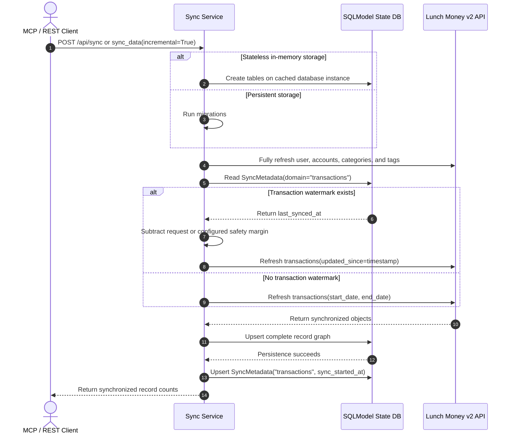

# 🔄 Incremental ETL Architecture & Sync Specification

## 📋 Overview

This document describes the delivered Sprint 0 **opt-in incremental transaction pipeline** for **Lunch Money MCP**. Transaction synchronization can resume from a UTC watermark with a configurable overlap, while user, account, category, and tag data continue to refresh in full. The default rolling transaction date window (`days=30`) and persistent SQLite storage remain unchanged unless the caller explicitly opts in.

---

## 🏛️ Directives & Key Design Decisions

> [!IMPORTANT]
> **1. Incremental Transaction Sync is Opt-In**:
>
> - Default behavior for `POST /api/sync` and `sync_data` FastMCP tool: `incremental: bool = False`.
> - When `incremental=False`, transactions use the standard rolling date window from `days: int = 30` (or explicit service-layer `start_date` / `end_date`) and no watermark is written.
> - When `incremental=True`, only transactions consult `SyncMetadata(domain="transactions")`. An existing watermark produces `updated_since = last_synced_at - timedelta(minutes=safety_margin)`; a missing watermark falls back to the standard date window.
> - User, Plaid account, manual account, category, and tag refreshes are full refreshes in both modes.

> [!IMPORTANT]
> **2. Parameterized Safety Overlap Window**:
>
> - `safety_margin_minutes` is available on both transports and overrides the configured value for that request.
> - When the override is omitted, `LUNCHMONEY_SYNC_SAFETY_MARGIN_MINUTES` supplies the value (default `5` minutes).

> [!IMPORTANT]
> **3. Watermarks Advance Only After Successful Persistence**:
>
> - Incremental execution captures a UTC start time, refreshes upstream data, and persists the record graph before writing the transaction watermark.
> - An upstream or record-persistence failure leaves an absent watermark absent and preserves an existing watermark at its exact prior timestamp.

> [!NOTE]
> **4. Stateless Storage is Explicit and Override-Safe**:
>
> - `LUNCHMONEY_STATELESS=true` selects a shared in-memory SQLite URL backed by `StaticPool` only when no explicit, environment, or dotenv database URL is configured.
> - Startup and explicit synchronization call `LunchMoneyDatabase.create_tables()` on the cached database instance in stateless mode; persistent databases continue to use Alembic migrations.

> **5. Ephemeral Storage Is Per Operation**:
>
> - `LUNCHMONEY_EPHEMERAL=true` is mutually exclusive with `LUNCHMONEY_STATELESS=true`.
> - REST requests and MCP tool/resource calls create a private in-memory SQLite database, refresh upstream data into it, execute the operation, and dispose it in a `finally` block.
> - Ephemeral mode does not initialize, migrate, or reuse the shared persistent or in-memory database.

> **6. Recurring Matches Come From Transactions**:
>
> - Recurring definitions are persisted by ID, while `found_transactions` is derived from the synchronized `transactions.recurring_id` relationship for the caller's requested window.
> - This prevents one synchronization window's recurring-match response from being reused for another window.

---

## System Architecture & Flow



---

## 🛠️ Code Specifications

### Configuration (`src/lunchmoney_mcp/config.py`)

```python
    model_config = SettingsConfigDict(env_prefix="LUNCHMONEY_")

    stateless: bool = False
    sync_safety_margin_minutes: int = 5
```

An explicit constructor URL, `LUNCHMONEY_DATABASE_URL`, or a dotenv-provided database URL takes precedence over `LUNCHMONEY_STATELESS=true`.

### Transport Interfaces

```text
POST /api/sync?days=30&incremental=true&safety_margin_minutes=5
```

```python
sync_data(
    days: int = 30,
    incremental: bool = False,
    safety_margin_minutes: int | None = None,
) -> SyncResult
```

The FastAPI router and FastMCP tool are pure delegators: both forward all three controls unchanged to the shared synchronization services.

### Database Model (`src/lunchmoney_mcp/database/models/sync.py`)

```python
class SyncMetadata(SQLModel, table=True):
    __tablename__ = "sync_metadata"

    domain: str = Field(primary_key=True)
    last_synced_at: datetime = Field(sa_type=UTCDateTime())
```

`domain` is the natural primary key, and timestamps are normalized to timezone-aware UTC during model initialization and database round trips. Sprint 0 creates and reads only the `transactions` domain; the schema remains domain-keyed for future incremental coverage without claiming that those domains are currently implemented.
