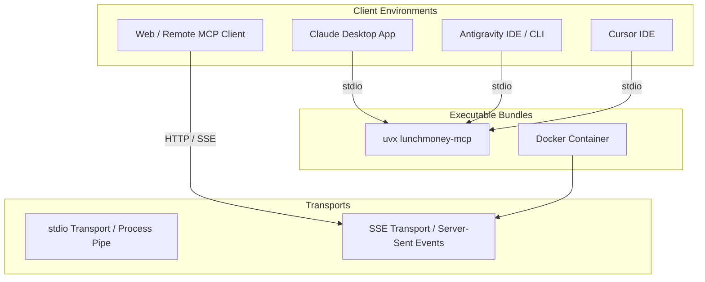

# 🔌 Advanced MCP Considerations & Integration Blueprint

## 📋 Overview

This document outlines advanced **Model Context Protocol (MCP)** considerations, packaging strategies, security patterns, and protocol primitives for **Lunch Money MCP**. It serves as an authoritative guide for extending the server beyond basic tools into a full-featured MCP ecosystem component.

---

## 🏗️ 1. Transports & Client Packaging ("Bundles")



### 1.1 Executable Entrypoint & PyPI `uvx` Bundling

Expose a clean CLI entrypoint in `pyproject.toml` so users and LLM clients can launch the server instantly via `uvx lunchmoney-mcp` or `pipx run lunchmoney-mcp` without manually cloning the repository:

```toml
# pyproject.toml
[project.scripts]
lunchmoney-mcp = "lunchmoney_mcp.mcp.server:main"
```

### 1.2 Multi-Transport Support

The executable supports FastMCP's four transports. `stdio` is the default for
local desktop clients; use the HTTP flags for remote server deployments:

```bash
lunchmoney-mcp                    # stdio
lunchmoney-mcp --stdio            # stdio (explicit)
lunchmoney-mcp --sse              # Server-Sent Events
lunchmoney-mcp --http             # HTTP
lunchmoney-mcp --streamable-http  # Streamable HTTP
```

### 1.3 Client Configuration Snippets

#### Claude Desktop (`claude_desktop_config.json`)

```json
{
  "mcpServers": {
    "lunchmoney": {
      "command": "uvx",
      "args": ["lunchmoney-mcp"],
      "env": {
        "LUNCHMONEY_ACCESS_TOKEN": "your_api_token_here"
      }
    }
  }
}
```

#### Antigravity MCP Config (`.gemini/config/mcp.json`)

```json
{
  "mcpServers": {
    "lunchmoney": {
      "command": "uv",
      "args": [
        "run",
        "--directory",
        "/path/to/lunchmoney-mcp",
        "lunchmoney-mcp"
      ],
      "env": {
        "LUNCHMONEY_ACCESS_TOKEN": "your_api_token_here"
      }
    }
  }
}
```

---

## 🔐 2. Authentication & Authorization (API Key vs. OAuth 2.0)

Set `LUNCHMONEY_MCP_API_KEY` to require an `X-API-Key` header on every REST API
request. Leave it unset for local development. This differs from
`LUNCHMONEY_ACCESS_TOKEN`, which is the server's credential for Lunch Money's
upstream API; MCP stdio and SSE transports use that upstream credential.

| Auth Model                 | Topology                  | Target Deployment                          | Implementation Details                                                                   |
| :------------------------- | :------------------------ | :----------------------------------------- | :--------------------------------------------------------------------------------------- |
| **Static Token (Current)** | Single-Tenant / Local     | Desktop Apps (Claude, Antigravity, Cursor) | Injected via `LUNCHMONEY_ACCESS_TOKEN` environment variable.                             |
| **Multi-Tenant OAuth 2.0** | Multi-User / Cloud Hosted | Web-Hosted MCP Servers / Remote SSE        | Lunch Money OAuth 2.0 PKCE flow. Per-session token resolution stored in context headers. |

---

## 📦 3. MCP Primitives: Resources & Prompts

Beyond function-calling **Tools**, MCP defines **Resources** (read-only context URIs) and **Prompts** (pre-built prompt templates).

### 3.1 MCP Resources (`lunchmoney://...`)

| Resource URI                       | Description                                           | Mime Type          |
| :--------------------------------- | :---------------------------------------------------- | :----------------- |
| `lunchmoney://summary`             | Instant account net worth & account balance breakdown | `text/markdown`    |
| `lunchmoney://categories`          | Complete category hierarchy and budget settings       | `application/json` |
| `lunchmoney://transactions/recent` | Stream of recent 30-day transactions                  | `application/json` |

### 3.2 MCP Prompts (Built-in Assistant Workflows)

- `budget_health_check`: Analyze monthly budget performance and highlight over-budget categories.
- `uncategorized_transactions_audit`: Find uncategorized transactions and recommend category assignments.
