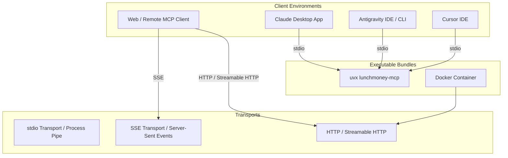

# 🔌 Advanced MCP Considerations & Integration Blueprint

## 📋 Overview

This document outlines advanced **Model Context Protocol (MCP)** considerations, packaging strategies, security patterns, and protocol primitives for **Lunch Money MCP**. It serves as an authoritative guide for extending the server beyond basic tools into a full-featured MCP ecosystem component.

---

## 🏗️ 1. Transports & Client Packaging ("Bundles")



### 1.1 Executable Entrypoint & PyPI `uvx` Bundling

Expose a clean CLI entrypoint in `pyproject.toml` so users and LLM clients can launch the server instantly via `uvx lunchmoney-mcp` or `pipx run lunchmoney-mcp` without manually cloning the repository:

```toml
# pyproject.toml
[project.scripts]
lunchmoney-mcp = "lunchmoney_mcp.mcp.server:main"
```

### 1.2 Multi-Transport Support

The executable supports FastMCP's four transports. `stdio` is the default for
local desktop clients; use the HTTP flags for remote server deployments:

```bash
lunchmoney-mcp                    # stdio
lunchmoney-mcp --stdio            # stdio (explicit)
lunchmoney-mcp --sse              # Server-Sent Events
lunchmoney-mcp --http             # HTTP
lunchmoney-mcp --streamable-http  # Streamable HTTP
```

For HTTP transports, the default bind address is `127.0.0.1:8000`. The MCP
endpoints are `http://127.0.0.1:8000/mcp` for HTTP and Streamable HTTP, and
`http://127.0.0.1:8000/sse` for SSE. Override the bind address as needed:

```bash
lunchmoney-mcp --streamable-http --host 0.0.0.0 --port 9000
```

`--host` and `--port` are invalid with `--stdio`. The four transport flags are
mutually exclusive.

### 1.3 Client Configuration Snippets

#### Claude Desktop (`claude_desktop_config.json`)

```json
{
  "mcpServers": {
    "lunchmoney": {
      "command": "uvx",
      "args": ["lunchmoney-mcp"],
      "env": {
        "LUNCHMONEY_ACCESS_TOKEN": "your_api_token_here"
      }
    }
  }
}
```

#### Antigravity MCP Config (`.gemini/config/mcp.json`)

```json
{
  "mcpServers": {
    "lunchmoney": {
      "command": "uv",
      "args": [
        "run",
        "--directory",
        "/path/to/lunchmoney-mcp",
        "lunchmoney-mcp"
      ],
      "env": {
        "LUNCHMONEY_ACCESS_TOKEN": "your_api_token_here"
      }
    }
  }
}
```

---

## 🔐 2. Authentication & Authorization (API Key vs. OAuth 2.0)

Set `LUNCHMONEY_MCP_API_KEY` to require an `X-API-Key` header on every REST API
request. Leave it unset for local development. This differs from
`LUNCHMONEY_ACCESS_TOKEN`, which is the server's credential for Lunch Money's
upstream API; every MCP transport uses that upstream credential.

| Auth Model                 | Topology                  | Target Deployment                          | Implementation Details                                                                   |
| :------------------------- | :------------------------ | :----------------------------------------- | :--------------------------------------------------------------------------------------- |
| **Static Token (Current)** | Single-Tenant / Local     | Desktop Apps (Claude, Antigravity, Cursor) | Injected via `LUNCHMONEY_ACCESS_TOKEN` environment variable.                             |
| **Multi-Tenant OAuth 2.0** | Multi-User / Cloud Hosted | Web-Hosted MCP Servers / Remote SSE        | Lunch Money OAuth 2.0 PKCE flow. Per-session token resolution stored in context headers. |

### 2.1 Remote MCP OAuth

HTTP, SSE, and Streamable HTTP MCP endpoints can use an upstream OIDC identity
provider through FastMCP's OAuth proxy. Configure all required values before
starting an HTTP transport:

```bash
export LUNCHMONEY_MCP_OAUTH_CONFIG_URL="https://id.example.com/.well-known/openid-configuration"
export LUNCHMONEY_MCP_OAUTH_CLIENT_ID="lunchmoney-mcp"
export LUNCHMONEY_MCP_OAUTH_CLIENT_SECRET="your-identity-provider-secret" # optional for public clients
export LUNCHMONEY_MCP_OAUTH_BASE_URL="https://mcp.example.com"
export LUNCHMONEY_MCP_OAUTH_AUDIENCE="https://mcp.example.com" # optional

lunchmoney-mcp --streamable-http --host 0.0.0.0 --port 8000
```

`LUNCHMONEY_MCP_OAUTH_BASE_URL` must be the public HTTPS origin, without the
`/mcp` path. Register `${LUNCHMONEY_MCP_OAUTH_BASE_URL}/auth/callback` as the
callback URL with the identity provider. FastMCP publishes OAuth metadata and
handles dynamic client registration and PKCE for compatible MCP clients.

OAuth is disabled when all required OAuth variables are unset, preserving local
stdio use. Supplying only some of `LUNCHMONEY_MCP_OAUTH_CONFIG_URL`,
`LUNCHMONEY_MCP_OAUTH_CLIENT_ID`, and `LUNCHMONEY_MCP_OAUTH_BASE_URL` prevents
startup so a remote endpoint cannot be accidentally left partially configured.

---

## 📦 3. MCP Primitives: Resources & Prompts

Beyond function-calling **Tools**, MCP defines **Resources** (read-only context URIs) and **Prompts** (pre-built prompt templates).

### 3.1 MCP Resources (`lunchmoney://...`)

| Resource URI              | Description                              | Mime Type          |
| :------------------------ | :--------------------------------------- | :----------------- |
| `lunchmoney://summary`    | Current-month budget summary with totals | `text/markdown`    |
| `lunchmoney://categories` | Complete synchronized category hierarchy | `application/json` |

### 3.2 MCP Prompts (Built-in Assistant Workflows)

- `budget_health_check`: Analyze monthly budget performance and highlight over-budget categories.
- `uncategorized_transactions_audit`: Find uncategorized transactions and recommend category assignments.
