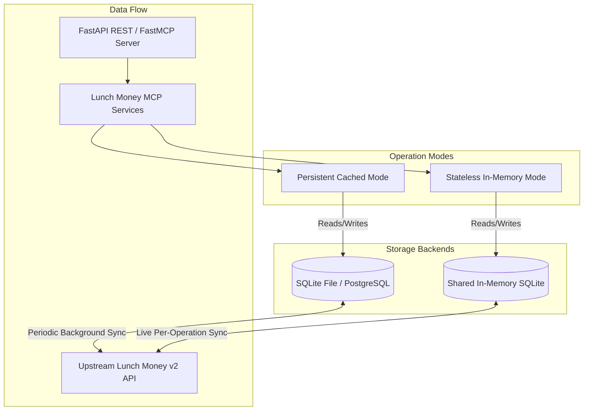

# 🚀 Lunch Money MCP — Master Roadmap & v2 API Coverage

## 📋 Executive Summary
This document serves as the master planning blueprint for **Lunch Money MCP**. It details:
1. Dual **Deployment Architectures** (Persistent Cached Mode vs. Stateless In-Memory Mode).
2. A **100% Granular Mapping** of all 39 endpoints across 10 domain areas in the [Lunch Money v2 OpenAPI Specification](https://alpha.lunchmoney.dev/v2/docs).
3. A 5-Sprint Implementation Plan for full production readiness.

---

## 🏛️ Deployment & Persistence Architectures

### 1. Persistent Cached Mode (Default)
- **Database Engine**: Persistent SQLite file (`lunchmoney.db`) or PostgreSQL database (`postgresql+asyncpg://`).
- **Sync Strategy**: Background worker or explicit `/sync` calls fetch upstream updates and upsert changes into the database. Reads are served instantaneously from local disk/database cache.
- **Use Cases**: Local CLI usage, long-running MCP servers, home-server deployments (Docker Compose).

### 2. Stateless In-Memory Mode (`STATELESS=true`)
- **Database Engine**: Shared in-memory SQLite (`sqlite+aiosqlite:///file:memdb?mode=memory&cache=shared&uri=true`) configured with `StaticPool`.
- **Sync Strategy**: **100% refreshed from Lunch Money v2 API on demand**. For every request or operation:
  1. An in-memory SQLite database instance is initialized and schema tables are instantiated.
  2. Data is fetched live from the Lunch Money API and loaded into memory.
  3. The request/tool operation is executed against the fresh in-memory data graph.
- **Use Cases**: Ephemeral containers, serverless environments (AWS Lambda, Google Cloud Run, Vercel), security-restricted environments where storing financial data on disk is forbidden.

---

## 📊 Granular v2 API Endpoint Coverage Matrix (39 Endpoints)

### 1. User & Account Summary (`/me`, `/summary`)
| Upstream v2 Endpoint | Method | Local Route | FastMCP Tool | Service Function | Status |
| :--- | :---: | :--- | :--- | :--- | :---: |
| `/me` | `GET` | `GET /user` | `get_user_info` | `fetch_user_info` | ✅ Done |
| `/summary` | `GET` | `GET /summary` | `get_account_summary` | `fetch_account_summary` | ⏳ Planned |

---

### 2. Categories Management (`/categories`)
| Upstream v2 Endpoint | Method | Local Route | FastMCP Tool | Service Function | Status |
| :--- | :---: | :--- | :--- | :--- | :---: |
| `/categories` | `GET` | `GET /categories` | `list_categories` | `fetch_categories` | ✅ Done |
| `/categories` | `POST` | `POST /categories` | `create_category` | `create_category` | ⏳ Planned |
| `/categories/{id}` | `GET` | `GET /categories/{id}` | `get_category` | `fetch_category_by_id` | ⏳ Planned |
| `/categories/{id}` | `PUT` | `PUT /categories/{id}` | `update_category` | `update_category` | ⏳ Planned |
| `/categories/{id}` | `DELETE` | `DELETE /categories/{id}` | `delete_category` | `delete_category` | ⏳ Planned |

---

### 3. Manual Accounts (`/manual_accounts`)
| Upstream v2 Endpoint | Method | Local Route | FastMCP Tool | Service Function | Status |
| :--- | :---: | :--- | :--- | :--- | :---: |
| `/manual_accounts` | `GET` | `GET /accounts/manual` | `list_manual_accounts` | `fetch_manual_accounts` | ✅ Done |
| `/manual_accounts` | `POST` | `POST /accounts/manual` | `create_manual_account` | `create_manual_account` | ⏳ Planned |
| `/manual_accounts/{id}` | `GET` | `GET /accounts/manual/{id}` | `get_manual_account` | `fetch_manual_account_by_id` | ⏳ Planned |
| `/manual_accounts/{id}` | `PUT` | `PUT /accounts/manual/{id}` | `update_manual_account` | `update_manual_account` | ⏳ Planned |
| `/manual_accounts/{id}` | `DELETE` | `DELETE /accounts/manual/{id}` | `delete_manual_account` | `delete_manual_account` | ⏳ Planned |

---

### 4. Plaid Accounts (`/plaid_accounts`)
| Upstream v2 Endpoint | Method | Local Route | FastMCP Tool | Service Function | Status |
| :--- | :---: | :--- | :--- | :--- | :---: |
| `/plaid_accounts` | `GET` | `GET /accounts/plaid` | `list_plaid_accounts` | `fetch_plaid_accounts` | ✅ Done |
| `/plaid_accounts/{id}` | `GET` | `GET /accounts/plaid/{id}` | `get_plaid_account` | `fetch_plaid_account_by_id` | ⏳ Planned |
| `/plaid_accounts/fetch` | `POST` | `POST /accounts/plaid/sync` | `trigger_plaid_fetch` | `trigger_plaid_fetch` | ⏳ Planned |

---

### 5. Transactions Management (`/transactions`)
| Upstream v2 Endpoint | Method | Local Route | FastMCP Tool | Service Function | Status |
| :--- | :---: | :--- | :--- | :--- | :---: |
| `/transactions` | `GET` | `GET /transactions` | `get_recent_transactions` | `fetch_recent_transactions` | ✅ Done |
| `/transactions` | `POST` | `POST /transactions` | `create_transactions` | `create_transactions` | ⏳ Planned |
| `/transactions` | `PUT` | `PUT /transactions` | `bulk_update_transactions` | `bulk_update_transactions` | ⏳ Planned |
| `/transactions` | `DELETE` | `DELETE /transactions` | `bulk_delete_transactions` | `bulk_delete_transactions` | ⏳ Planned |
| `/transactions/{id}` | `GET` | `GET /transactions/{id}` | `get_transaction` | `fetch_transaction_by_id` | ⏳ Planned |
| `/transactions/{id}` | `PUT` | `PUT /transactions/{id}` | `update_transaction` | `update_transaction` | ⏳ Planned |
| `/transactions/{id}` | `DELETE` | `DELETE /transactions/{id}` | `delete_transaction` | `delete_transaction` | ⏳ Planned |

---

### 6. Transaction Grouping & Splitting (`/transactions/group`, `/transactions/split`)
| Upstream v2 Endpoint | Method | Local Route | FastMCP Tool | Service Function | Status |
| :--- | :---: | :--- | :--- | :--- | :---: |
| `/transactions/group` | `POST` | `POST /transactions/group` | `group_transactions` | `create_transaction_group` | ⏳ Planned |
| `/transactions/group/{id}` | `DELETE` | `DELETE /transactions/group/{id}` | `ungroup_transactions` | `delete_transaction_group` | ⏳ Planned |
| `/transactions/split/{id}` | `POST` | `POST /transactions/split/{id}` | `split_transaction` | `split_transaction` | ⏳ Planned |
| `/transactions/split/{id}` | `DELETE` | `DELETE /transactions/split/{id}` | `unsplit_transaction` | `unsplit_transaction` | ⏳ Planned |

---

### 7. Transaction Attachments (`/transactions/attachments`)
| Upstream v2 Endpoint | Method | Local Route | FastMCP Tool | Service Function | Status |
| :--- | :---: | :--- | :--- | :--- | :---: |
| `/transactions/{id}/attachments` | `POST` | `POST /transactions/{id}/attachments` | `upload_attachment` | `upload_transaction_attachment` | ⏳ Planned |
| `/transactions/attachments/{file_id}` | `GET` | `GET /transactions/attachments/{file_id}` | `get_attachment` | `fetch_attachment_by_id` | ⏳ Planned |
| `/transactions/attachments/{file_id}` | `DELETE` | `DELETE /transactions/attachments/{file_id}` | `delete_attachment` | `delete_attachment` | ⏳ Planned |

---

### 8. Tags Management (`/tags`)
| Upstream v2 Endpoint | Method | Local Route | FastMCP Tool | Service Function | Status |
| :--- | :---: | :--- | :--- | :--- | :---: |
| `/tags` | `GET` | `GET /tags` | `list_tags` | `fetch_tags` | ⏳ Planned |
| `/tags` | `POST` | `POST /tags` | `create_tag` | `create_tag` | ⏳ Planned |
| `/tags/{id}` | `GET` | `GET /tags/{id}` | `get_tag` | `fetch_tag_by_id` | ⏳ Planned |
| `/tags/{id}` | `PUT` | `PUT /tags/{id}` | `update_tag` | `update_tag` | ⏳ Planned |
| `/tags/{id}` | `DELETE` | `DELETE /tags/{id}` | `delete_tag` | `delete_tag` | ⏳ Planned |

---

### 9. Recurring Items (`/recurring_items`)
| Upstream v2 Endpoint | Method | Local Route | FastMCP Tool | Service Function | Status |
| :--- | :---: | :--- | :--- | :--- | :---: |
| `/recurring_items` | `GET` | `GET /recurring_items` | `list_recurring_items` | `fetch_recurring_items` | ⏳ Planned |
| `/recurring_items/{id}` | `GET` | `GET /recurring_items/{id}` | `get_recurring_item` | `fetch_recurring_item_by_id` | ⏳ Planned |

---

### 10. Budgets & Local Analytics (`/budgets`, `/spending`)
| Upstream v2 Endpoint / Local Feature | Method | Local Route | FastMCP Tool | Service Function | Status |
| :--- | :---: | :--- | :--- | :--- | :---: |
| `/budgets/settings` | `GET` | `GET /budgets/settings` | `get_budget_settings` | `fetch_budget_settings` | ⏳ Planned |
| `/budgets` | `PUT` | `PUT /budgets` | `upsert_budget` | `set_budget_value` | ⏳ Planned |
| `/budgets` | `DELETE` | `DELETE /budgets` | `clear_budget` | `clear_budget_value` | ⏳ Planned |
| Local Analytics (Category Rollup) | `GET` | `GET /spending/category` | `get_category_spending` | `fetch_category_spending` | ✅ Done |

---

## 🎯 Implementation Sprint Plan

### Sprint 0: Incremental ETL Engine Architecture
- [ ] Add `STATELESS=true` setting & `IN_MEMORY_DATABASE_URL` resolution in `config.py`.
- [ ] Add `StaticPool` in-memory SQLite initialization in `LunchMoneyDatabase`.
- [ ] Add `db.create_tables()` schema initialization helper.
- [ ] Add `SyncMetadata` table and opt-in incremental sync timestamp filtering.

### Sprint 1: Read-Only Complete Coverage (Tags, Recurring, Summary, Single-ID Lookups)
- [ ] Implement `GET /summary` (`get_account_summary`)
- [ ] Implement `GET /tags` & `GET /tags/{id}`
- [ ] Implement `GET /recurring_items` & `GET /recurring_items/{id}`
- [ ] Implement Single-ID GET routes (`/categories/{id}`, `/accounts/manual/{id}`, `/accounts/plaid/{id}`, `/transactions/{id}`)

### Sprint 2: Category & Account Mutations (Write Operations)
- [ ] Implement Category mutations (`POST`, `PUT`, `DELETE` `/categories`)
- [ ] Implement Manual Account mutations (`POST`, `PUT`, `DELETE` `/manual_accounts`)
- [ ] Implement Plaid sync trigger (`POST /plaid_accounts/fetch`)

### Sprint 3: Transaction Mutations & Advanced Operations
- [ ] Implement Transaction CRUD (`POST`, `PUT`, `DELETE` `/transactions`)
- [ ] Implement Bulk Transaction operations (`PUT`, `DELETE` `/transactions`)
- [ ] Implement Transaction Grouping (`POST /transactions/group`, `DELETE /transactions/group/{id}`)
- [ ] Implement Transaction Splitting (`POST /transactions/split/{id}`, `DELETE /transactions/split/{id}`)
- [ ] Implement Transaction Attachments (`POST`, `GET`, `DELETE` `/transactions/attachments`)

### Sprint 4: Budgets, Analytics & Production Security
- [ ] Implement Budget Settings & Values (`GET /budgets/settings`, `PUT /budgets`, `DELETE /budgets`)
- [ ] Implement Spending Trends time-series analysis (`GET /spending/trends`)
- [ ] API Key auth guard & GitHub Actions CI/CD workflows (`.github/workflows/ci.yaml`).
