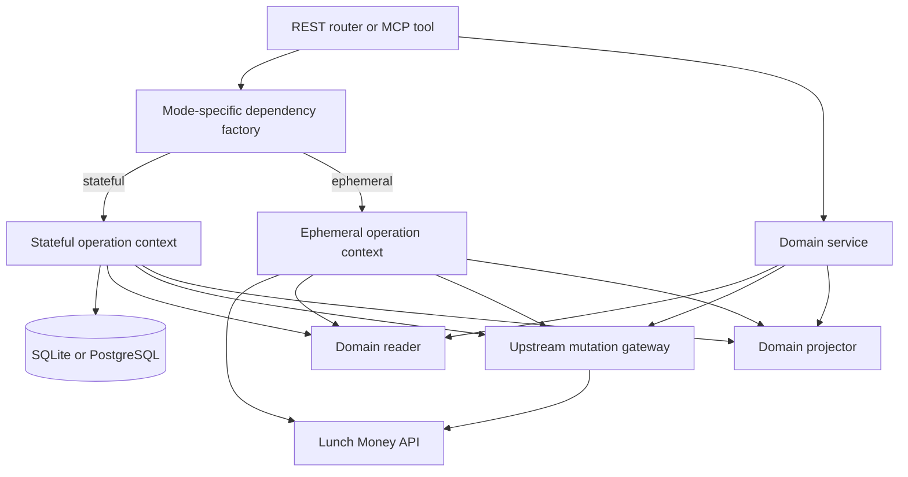

# Ephemeral and Stateful Runtime Design

## Status

Implemented and verified. This design replaced the former `stateless`
shared-memory SQLite mode and SQLite-backed `ephemeral` mode with two explicit
persistence modes.

Implementation companions:

- [`EPHEMERAL_ENDPOINT_MATRIX.md`](EPHEMERAL_ENDPOINT_MATRIX.md) defines the
  required behavior of every public surface.
- [`EPHEMERAL_IMPLEMENTATION_HANDOFF.md`](EPHEMERAL_IMPLEMENTATION_HANDOFF.md)
  divides the migration into bounded, dependency-ordered agent packets.
- [`EPHEMERAL_VERIFICATION.md`](EPHEMERAL_VERIFICATION.md) defines fixtures,
  architecture guards, test contracts, and completion evidence.

## Problem

Before this design was implemented, the runtime exposed two non-persistent
variants:

- `stateless` creates a process-shared, in-memory SQLite cache.
- `ephemeral` creates a private in-memory SQLite database for each REST or MCP
  operation, synchronizes Lunch Money data into it, executes the operation,
  and disposes it.

Neither variant is database-free. The ephemeral path still creates schemas,
converts upstream models into SQLModel records, performs upserts and queries,
and retains financial data in memory for the duration of the request. This
adds work and couples every operation to the persistence layer.

## Goals

- Provide exactly two modes: `stateful` and `ephemeral`.
- Make ephemeral mode database-free: no SQLite engine, schema, migrations,
  local locks, SQLModel records, or stored financial data.
- Preserve stateful mode as the cache and synchronization mode using the
  operator-configured SQLite or PostgreSQL database.
- Keep all writes upstream-first in both modes.
- Keep REST and MCP behavior aligned for a selected mode.
- Make the mode choice explicit, validated, and visible to operators.

## Non-goals

- Replacing SQLModel or changing stateful storage semantics.
- Adding an in-process cache that survives an ephemeral operation.
- Guaranteeing equal latency between an upstream-backed ephemeral request and
  a warm stateful cache.
- Making synchronization, incremental watermarks, or scheduled sync operate
  without durable storage.

## Configuration

Replace the two booleans `LUNCHMONEY_STATELESS` and
`LUNCHMONEY_EPHEMERAL` with one setting:

```text
LUNCHMONEY_PERSISTENCE_MODE=stateful|ephemeral
```

`stateful` is the default. Invalid values fail configuration validation.

CLI commands expose an equivalent mutually exclusive choice:

```text
--persistence-mode stateful|ephemeral
```

The MCP stdio transport continues to default to `ephemeral` only when the
operator supplied no persistence-mode value. HTTP transports default to
`stateful`.

Ephemeral mode and explicitly supplied database settings are mutually
exclusive. If an operator selects `ephemeral` and also supplies a database URL
or other database-specific setting, configuration validation fails before the
runtime starts. The application's internal default database URL does not count
as explicitly supplied configuration. This distinction preserves the
database-free contract while allowing stdio to select its ephemeral default.

Scheduler settings that enable scheduled or embedded synchronization are also
invalid in ephemeral mode. Settings parsing must retain enough source
information to distinguish defaults from values explicitly supplied through
supported configuration sources.

## Mode Contract

| Concern                    | Stateful                              | Ephemeral                     |
| -------------------------- | ------------------------------------- | ----------------------------- |
| Storage                    | Configured SQLite or PostgreSQL       | None                          |
| Reads                      | Local synchronized cache              | Lunch Money API per operation |
| Writes                     | Upstream write, then local projection | Upstream write only           |
| Migrations                 | Run at startup and explicit sync      | Never run                     |
| Locks                      | Used for migration and scheduled sync | Not used                      |
| Incremental sync           | Supported through `SyncMetadata`      | Unsupported                   |
| Scheduled sync/history     | Supported and persisted               | Disabled                      |
| Dashboard                  | Available                             | Disabled                      |
| Cache freshness statistics | Available                             | Not applicable                |

An ephemeral request can retain ordinary Python values while constructing its
response. It must not create a database or a reusable cache.

## Architecture

Services must not select behavior by calling `get_settings()` internally.
Instead, transport dependencies select concrete collaborators at the boundary
and pass them to services. This keeps business logic testable and prevents
mode checks from spreading through routers and MCP tools.

Each REST request, MCP tool call, and MCP resource read receives one immutable
`OperationContext`. It contains the selected domain readers, upstream mutation
gateways, projectors, persistence mode, and optional operation-local
memoization. Services accept the context or a narrower collaborator explicitly.
Only transport dependency code may use an ambient accessor to obtain the
currently bound context.

An `OperationContextFactory` owns context creation and cleanup. Concrete
`StatefulOperationContextFactory` and `EphemeralOperationContextFactory`
implement the two lifecycles. Transport middleware enters the factory context,
binds it for the complete operation, and resets it unconditionally. Contexts
must not escape into background tasks or remain accessible after the operation
finishes.

Ephemeral memoization exists only until the operation completes and is
discarded with the response. It is not a reusable cache and must never create
a database. The shared Lunch Money client must likewise not retain financial
models across ephemeral operations.



### Read interfaces

Use small structural interfaces (`typing.Protocol`) that describe concrete
domain operations, not a broad database-shaped abstraction. For example:

```python
class TransactionReader(Protocol):
    async def list(self, query: TransactionQuery) -> Sequence[TransactionObject]: ...

    async def get(
        self, transaction_id: int
    ) -> TransactionObject | ChildTransactionObject | None: ...
```

`StatefulTransactionReader` adapts the existing database queries.
`EphemeralTransactionReader` calls Lunch Money and applies any response
normalization required by the public contract. Equivalent focused readers are
needed for categories, accounts, tags, user, recurring items, budgets, and
summaries.

All readers return canonical generated `lunchmoney.models` API objects or
application response schemas composed from those objects. SQLModel records are
private to stateful adapters and never cross a reader boundary. Stateful and
ephemeral readers must preserve the same public filtering, hierarchy, ordering,
not-found, and response-shape semantics when given equivalent source data.

Do not introduce a generic SQLModel repository for every domain. Transaction
hierarchies, category controls, and summaries are domain behavior rather than
generic CRUD. Generic typing is limited to common collection boundaries where
it improves clarity.

### Mutation and projection interfaces

An upstream mutation gateway owns authoritative Lunch Money writes in both
modes. Projection is a separate post-write concern expressed through focused
domain adapter methods.

Stateful projectors update cached records and invalidate affected snapshots.
Ephemeral projectors are no-ops. Projectors are domain-focused where deletion,
bulk mutation, relation reconciliation, or snapshot invalidation needs richer
methods. A fake `NullDatabase` and one universal CRUD projector are explicitly
avoided because both would preserve database-shaped coupling.

Once Lunch Money accepts a mutation, its canonical response remains the
operation result even if stateful projection fails. Projection failure must not
turn a completed upstream write into a generic failure that encourages an
unsafe retry. The affected cache domain is marked stale, the failure is
reported through safe logs and health telemetry, and later synchronization
reconciles it. When the database is available, the stale marker is persisted so
all workers observe it; if that marker cannot be persisted, readiness is
degraded until storage recovers.

## Ephemeral Upstream Contract

Ephemeral mode is live-only. If an upstream request fails, the ordinary data
operation fails; it must not fall back to a local database, create temporary
SQLite storage, or return a stale cached response.

All upstream calls use the client's shared timeout and error mapping.
Automatic retries are limited to safe or demonstrably idempotent requests;
non-idempotent mutations are not retried unless Lunch Money provides an
idempotency guarantee. Collection readers consume required pagination
internally. Analytics sources bound transaction queries to the requested
period, and fan-out for independent upstream calls is bounded.

Operation-local memoization coalesces concurrent equivalent reads and keys
entries by the complete normalized query. It never memoizes exceptions.
Successful mutations invalidate or replace affected entries so a later read in
the same operation cannot return a pre-mutation value. Memoized values are
immutable or copied on return so callers cannot mutate shared operation state.

### Analytics

Spending and trend services should accept a focused source that yields
categories and transactions for a period. Both implementations return
generated Lunch Money API models. The existing Python aggregation code is then
shared, while only acquisition differs:

- stateful source performs bounded SQL queries;
- ephemeral source requests the required upstream categories and transactions.

## Endpoint Behavior

### Mode errors

Every operation that requires retained state uses one transport-neutral domain
error with code `stateful_mode_required`. REST maps it to HTTP `409 Conflict`
with this JSON body, including for dashboard and HTMX requests:

```json
{
    "detail": {
        "code": "stateful_mode_required",
        "message": "This operation requires stateful persistence mode."
    }
}
```

MCP maps the same code and message to an error result (`isError: true`) whose
text content is the serialized error object. CLI entrypoints print the safe
message and exit nonzero. Services raise the domain error and do not contain
transport-specific response construction.

### Read operations

All normal data reads remain available in both modes. In ephemeral mode, list
and detail operations fetch current upstream data instead of requiring a prior
sync. Detail endpoints may use an upstream detail API when available, or fetch
the relevant collection and select the matching model.

Before implementing a domain, its operations are recorded in an endpoint
capability matrix with the stateful source, upstream source, pagination and
filtering requirements, and expected not-found behavior. An operation remains
available in ephemeral mode when it can be reproduced from bounded upstream
collections and Python computation. If Lunch Money does not expose the source
data required for a truthful result, that operation is explicitly marked
stateful-only and returns `stateful_mode_required`; it must not return a partial
or misleading approximation.

### Mutations

All existing mutations remain available in both modes. In stateful mode, the
canonical upstream response is projected into the local cache. In ephemeral
mode, return the canonical upstream response and skip persistent
reconciliation. Successful mutations invalidate or update related
operation-local reads in either mode.

Ungrouping currently depends on cached child identifiers; its ephemeral
implementation must obtain the needed transaction graph from Lunch Money
before the mutation, or use an upstream response that supplies it. Attachment
deletion needs no local owner scan in ephemeral mode.

### Synchronization and scheduling

`POST /api/sync`, the `sync_data` tool, scheduled synchronization, and sync
status require stateful storage. In ephemeral mode they return a clear
mode-specific error with the stable code `stateful_mode_required`, explaining
that synchronization is available only in stateful mode. REST returns HTTP
`409 Conflict`; MCP tools return the same code in their structured error
payload. Configuration that enables scheduling is rejected during validation
when ephemeral mode is selected.

### Dashboard, health, and diagnostics

The HTML dashboard and its dashboard-specific actions require stateful mode.
In ephemeral mode, dashboard routes return HTTP `409 Conflict` with the stable
code `stateful_mode_required`; they do not fetch or render live financial data.

Health checks in ephemeral mode report application and upstream configuration
health without performing a database readiness query or making upstream
availability a readiness dependency. The `doctor` command does not validate a
database directory or connection for ephemeral mode.

## Lifecycle Changes

- Delete `IN_MEMORY_DATABASE_URL` and the `is_stateless` database property.
  Retain any narrowly scoped engine configuration required for an explicitly
  supplied in-memory SQLite URL, but do not expose it as a runtime mode.
- Treat supplied database URLs uniformly within stateful mode. In-memory SQLite
  compatibility, including connection/pool handling and its process-local
  multi-worker limitation, belongs in database-backend documentation rather
  than persistence-mode documentation.
- Delete the private in-memory database construction in `data_operation`.
- In stateful mode, lifespan continues to initialize migrations and dispose the
  shared database.
- In ephemeral mode, startup rejects explicitly supplied database settings,
  lifespan does not resolve a database, and operation middleware only binds the
  live readers, mutation gateways, and no-op projectors.
- Database dependencies must not fall back to `get_shared_database()` when an
  ephemeral operation is active.

## Migration Plan

1. Add `persistence_mode` settings and CLI parsing with `stateful` as default,
   including database and scheduler conflict validation.
2. Add the operation-context factories, domain reader and projector interfaces,
   mutation gateways, and stateful adapters without changing stateful behavior.
3. Implement ephemeral readers domain by domain, beginning with transactions,
   categories, accounts, user, tags, budgets, summaries, and recurring items.
4. Refactor spending and trends to consume domain sources rather than SQLModel
   sessions, and enforce the stateful-only dashboard boundary.
5. Make mutation projection conditional through projectors and resolve the
   ungrouping graph requirement using the upstream client.
6. Mark synchronization and scheduling stateful-only, then update health and
   diagnostics.
7. Remove `stateless`, the built-in in-memory SQLite default, and the
   database-backed ephemeral operation lifecycle. Preserve explicitly supplied
   in-memory SQLite URLs as stateful database configuration.
8. Update user-facing documentation for the two supported modes.

Each step preserves stateful behavior before proceeding to the next.

## Test Plan

- Configuration accepts only `stateful` and `ephemeral` and rejects explicitly
  supplied database or enabled scheduler settings with ephemeral mode.
- Ephemeral REST, MCP tools, and resources do not construct
  `LunchMoneyDatabase`, run migrations, or acquire database locks.
- Ephemeral requests can reuse live values within one operation, but the next
  operation performs new upstream reads and cannot access prior values.
- The shared client does not retain financial models across ephemeral
  operations, and successful mutations invalidate affected operation-local
  reads.
- Ephemeral reads call the appropriate upstream client and preserve response
  schemas and query filtering behavior.
- Ephemeral writes call upstream and do not invoke projectors that persist.
- Non-idempotent mutations are not automatically retried, and a stateful
  projection failure returns the successful upstream result while marking cache
  health stale.
- Upstream failures in ephemeral mode do not fall back to local state.
- Stateful reads, writes, cache invalidation, migration, sync, incremental
  watermarks, and scheduled-run history retain existing coverage.
- Stateful-only sync and scheduler endpoints return the documented mode error
  in ephemeral mode.
- Dashboard routes return the documented mode error in ephemeral mode; health
  remains database-free and does not depend on a successful upstream probe.
- Shared endpoint fixtures verify compatible response schemas in both modes,
  plus filtering, hierarchy, ordering, pagination, not-found, grouped/split
  transaction, pending, tag, and date-boundary semantics. Documented
  stateful-only operations are excluded from parity fixtures.

Run the complete verification suite before considering the migration complete:

```text
task fix && task lint && task check && task test
```

## Acceptance Criteria

- There are no `stateless` settings, CLI flags, documentation claims, or
  built-in in-memory SQLite defaults in the supported runtime.
- An ephemeral request works without instantiating a SQLAlchemy engine or
  `LunchMoneyDatabase`.
- Selecting ephemeral mode with explicitly supplied database settings or
  enabled scheduling fails configuration validation before startup.
- Ephemeral upstream failures never return local or stale data.
- No shared application client or operation context retains financial models
  after an ephemeral operation completes.
- Statefulness is explicit through one validated mode setting.
- Stateful mode continues to support durable cache reads, synchronization,
  watermarks, migrations, and scheduling.
- All public read and write operations that do not inherently require retained
  state work through the Lunch Money API in ephemeral mode.
- The dashboard, synchronization, scheduling, cache status, and any operation
  without sufficient upstream source data consistently return
  `stateful_mode_required` in ephemeral mode.
