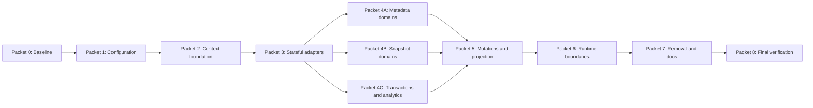

# Ephemeral and Stateful Implementation Hand-off

## Purpose and Authority

This document divides the approved persistence-mode design into bounded work
packets suitable for implementation by independent coding agents. It does not
replace the design. Read these documents in order before claiming a packet:

1. [`DESIGN_EPHEMERAL_STATEFUL.md`](DESIGN_EPHEMERAL_STATEFUL.md)
2. [`EPHEMERAL_ENDPOINT_MATRIX.md`](EPHEMERAL_ENDPOINT_MATRIX.md)
3. This hand-off
4. [`EPHEMERAL_VERIFICATION.md`](EPHEMERAL_VERIFICATION.md)

When documents disagree, the design has priority, followed by the endpoint
matrix. Stop and update the documentation before implementing an unrecorded
behavioral change.

## Locked Decisions

Agents must not reopen these decisions during implementation:

- The only runtime modes are `stateful` and `ephemeral`.
- HTTP defaults to stateful. MCP stdio defaults to ephemeral only when no mode
  was explicitly selected.
- Ephemeral mode creates no database engine, schema, migration, lock, SQLModel
  record, persistent snapshot, or cross-operation financial-data cache.
- Explicit database configuration and enabled scheduler configuration are
  startup errors in ephemeral mode.
- An explicitly configured in-memory SQLite URL remains valid database
  configuration in stateful mode; it is not a third mode.
- The dashboard, sync, sync status, scheduler, watermarks, and cache-status
  operations are stateful-only.
- Ordinary reads and writes remain available in ephemeral mode when Lunch Money
  exposes enough source data for a truthful result.
- Services receive an operation context or focused collaborator and do not read
  persistence settings internally.
- Reader boundaries expose generated Lunch Money API models or application
  response schemas, never SQLModel records.
- Upstream writes are authoritative. Projection failure does not convert an
  accepted write into a generic failed response.
- Non-idempotent mutations are not automatically retried.
- REST and MCP share service behavior and the `stateful_mode_required` domain
  error.

## Target Responsibility Map

This is a responsibility map, not permission for broad refactoring. Preserve
the project's domain-aligned service, router, and MCP modules.

| Area                   | Final responsibility                                                                                             | Primary current files                                                                                                               |
| ---------------------- | ---------------------------------------------------------------------------------------------------------------- | ----------------------------------------------------------------------------------------------------------------------------------- |
| Configuration          | `PersistenceMode`, defaults, explicit-source tracking, database/scheduler conflict validation, CLI exposure      | `src/lunchmoney_app/config.py`, `src/lunchmoney_app/cli.py`, `src/lunchmoney_app/mcp/server.py`, `src/lunchmoney_app/completion.py` |
| Operation lifecycle    | Immutable context, context accessor for transport dependencies, factories, operation memo, unconditional cleanup | `src/lunchmoney_app/services/operations.py`                                                                                         |
| Transport dependencies | Bind one context and expose it to thin REST/MCP delegators; never fall back to shared DB in ephemeral mode       | `src/lunchmoney_app/app/dependencies.py`, `src/lunchmoney_app/app/main.py`, `src/lunchmoney_app/mcp/operations.py`                  |
| Domain orchestration   | Focused reader/projector protocols and business workflows independent of mode                                    | Existing `src/lunchmoney_app/services/{domain}.py` modules                                                                          |
| Domain adapters        | Stateful and ephemeral reader, gateway, and projector implementations                                            | New `src/lunchmoney_app/services/adapters/{domain}.py` modules                                                                      |
| Mutations              | Authoritative upstream call, operation invalidation, stateful projection, projection-failure handling            | Existing domain service modules                                                                                                     |
| Stateful storage       | URL resolution, migrations, pooling, sessions, SQLModel conversion                                               | `src/lunchmoney_app/database/`                                                                                                      |
| Runtime lifecycle      | Stateful migrations/disposal; ephemeral storage-free startup                                                     | `src/lunchmoney_app/app/lifespan.py`, `src/lunchmoney_app/mcp/app.py`, scheduler entrypoints                                        |
| Mode boundaries        | Shared domain error and transport mappings                                                                       | Service error module or existing schema/error location, REST middleware/handlers, MCP middleware/tools, CLI                         |
| Tests                  | Configuration, lifecycle guards, reader contracts, domain parity, transport mapping                              | Existing domain test files plus focused persistence-mode contract files described in the verification guide                         |

### Locked file organization

Use this layout consistently:

```text
src/lunchmoney_app/services/
├── errors.py                 shared service-domain errors
├── operations.py             context, factories, memo, and binding lifecycle
├── adapters/
│   ├── __init__.py           intentional public adapter exports only
│   ├── base.py               small reusable generic adapter contracts
│   ├── accounts.py           stateful/ephemeral account collaborators
│   ├── budgets.py
│   ├── categories.py
│   ├── recurring.py
│   ├── summary.py
│   ├── tags.py
│   ├── transactions.py
│   └── user.py
├── accounts.py               mode-independent domain orchestration and ports
├── budgets.py
├── categories.py
└── ...                       existing domain-aligned service modules
```

Spending uses the category and transaction readers and does not receive a
separate persistence adapter unless implementation reveals a genuinely unique
source operation. Mutation gateways and projectors live in the corresponding
domain adapter module. Domain services declare or import focused ports and do
not import concrete adapters. `operations.py` is the composition root that
constructs concrete adapter bundles. This layout keeps the required one-to-one
domain service modules while isolating mode-specific acquisition.

## Conceptual Contracts

These signatures document responsibilities rather than prescribing exact
names. Agents may make small type-shape adjustments required by Python, but may
not weaken the boundaries.

```python
class PersistenceMode(StrEnum):
    STATEFUL = "stateful"
    EPHEMERAL = "ephemeral"


@dataclass(frozen=True)
class OperationContext:
    mode: PersistenceMode
    sources: DomainSources
    mutations: DomainMutationGateways
    projectors: DomainProjectors
    memo: OperationMemo | None
```

The full context is not generic. Consumer-facing protocols use concrete domain
query and result types. A generic base protocol is justified only when multiple
runtime consumers use it directly and it removes real duplication.

Do not force delete, bulk reconciliation, grouping, attachments, or snapshots
through a generic CRUD projector. Give those domains focused projection
methods. Do not introduce `NullDatabase`, `Database | None` branching, a broad
repository base class, or generic SQLModel repositories.

### Context access

- REST and MCP middleware enter the selected context factory once per complete
  request, tool call, or resource read.
- Transport dependency functions may retrieve the bound context through a
  `ContextVar` accessor.
- Routers and MCP tools pass the context or a narrow collaborator to services.
- Services never call `get_settings()` to choose a mode.
- The accessor raises a clear internal error when no operation is bound; it
  never creates a shared database as a fallback.
- Health, readiness, metrics, prompts, and configuration validation do not need
  a data-operation context.

### Operation memo

The memo is an ephemeral-context implementation detail. It must:

- key reads by domain, operation, and a complete canonical serialization of
  input values;
- coalesce concurrent equivalent reads;
- never retain exceptions;
- return immutable values or safe copies;
- invalidate or replace affected entries after a successful mutation;
- be unreachable after context exit;
- never delegate to `LunchMoneyApp.data` or another process-shared cache.

## Dependency Sequence



Packets 4A, 4B, and 4C may run in parallel only after the foundation owner has
landed Packet 3. Parallel owners must not edit shared context, configuration,
transport, or package-export files. A single integration owner performs shared
wiring after domain work is complete.

## Packet 0: Baseline and Claim

### Objective

Establish a clean, reproducible baseline and record ownership before code
changes.

### Allowed changes

- Maintainer checklist ownership/status only.
- Documentation corrections discovered during inventory.

### Required actions

1. Read all four persistence-mode documents.
2. Inspect `git status` and preserve unrelated user changes.
3. Run the full existing suite once.
4. Record any existing failures without attempting adjacent cleanup.
5. Confirm the pinned upstream coverage manifest still lists the methods used
   by the endpoint matrix.

### Completion evidence

- Baseline command outputs recorded in the hand-off message.
- Claimed packet and exact file ownership recorded for other agents.

## Packet 1: Configuration and CLI Contract

### Objective

Replace persistence booleans with one validated mode without changing domain
behavior yet.

### Primary files

- `src/lunchmoney_app/config.py`
- `src/lunchmoney_app/cli.py`
- `src/lunchmoney_app/mcp/server.py`
- `src/lunchmoney_app/completion.py`
- `tests/test_config.py`
- `tests/test_cli.py`
- `tests/test_completion.py`
- `tests/test_doctor.py`

### Required behavior

- Accept only `stateful` and `ephemeral`.
- Default HTTP runtime to stateful.
- Default MCP stdio to ephemeral only when the mode was not supplied.
- Track whether database configuration came from an explicit supported source;
  the internal default URL is not explicit.
- Reject ephemeral plus explicit database configuration.
- Reject ephemeral plus any enabled scheduler/embedded-scheduler setting.
- Keep explicit in-memory SQLite URLs valid in stateful mode.
- Update doctor output without opening a database in ephemeral mode.

### Non-goals

- Do not change database construction or service behavior in this packet.
- Do not retain compatibility aliases or migration warnings.
- Do not add a third mode for memory URLs.

### Verification

Run focused configuration, CLI, completion, and doctor tests plus style and type
checks. Do not proceed while source-explicitness behavior is untested.

## Packet 2: Operation Context Foundation

### Objective

Introduce the operation-scoped abstractions and error contract while leaving
existing stateful behavior reachable through adapters.

### Primary files

- `src/lunchmoney_app/services/operations.py`
- Chosen shared contract/error module
- `src/lunchmoney_app/app/dependencies.py`
- `src/lunchmoney_app/app/main.py`
- `src/lunchmoney_app/mcp/operations.py`
- `tests/test_operations.py`
- `tests/test_app.py`
- `tests/test_mcp.py`

### Required behavior

- Define immutable `OperationContext` and concrete stateful/ephemeral factories.
- Bind exactly one context per REST request, MCP tool call, and MCP resource
  read; reset it in `finally` behavior.
- Define `StatefulModeRequired` with stable code
  `stateful_mode_required` and transport mappings from the design.
- Provide operation memo semantics, including concurrent request coalescing and
  mutation invalidation.
- Ensure access outside a bound operation fails rather than resolving storage.
- Create the locked domain adapter package layout without implementing unrelated
  domain behavior.

### Temporary compatibility

A narrow stateful adapter may wrap the existing database dependency during this
packet. Temporary compatibility must be explicitly marked and removed by
Packet 7. Do not make ephemeral mode construct the current private database to
keep tests passing.

### Verification

Use lifecycle tests that enter, access, exit, and then prove the context is no
longer accessible. Cover exceptions and nested asynchronous calls.

## Packet 3: Stateful Adapters Without Behavior Change

### Objective

Move current database-shaped reads and projections behind domain boundaries
while preserving stateful outputs.

### Primary files

- Domain service and matching `services/adapters/` modules
- Existing stateful domain tests under `tests/`
- Database tests only when adapter behavior requires them

### Required behavior

- Stateful readers return canonical generated API models.
- SQLModel records do not escape adapters.
- Existing filters, ordering, snapshots, cache invalidation, and sync behavior
  remain unchanged.
- Services accept collaborators rather than `live` booleans or mode settings.
- No ephemeral upstream reader is required beyond a minimal test fake in this
  packet.

### Non-goals

- Do not rewrite SQL queries for performance.
- Do not change stateful freshness policy.
- Do not remove database lifecycle code yet.

### Verification

Run all existing read, mutation, persistence, incremental-sync, and scheduler
tests. Add adapter contract tests that assert API-model return types.

## Packet 4A: Metadata Domain Ephemeral Readers

### Objective

Implement live readers for user, accounts, categories, and tags.

### Owned domain files

- `services/user.py`
- `services/accounts.py`
- `services/categories.py`
- `services/tags.py`
- Corresponding `services/adapters/` domain modules
- Domain-focused tests only

### Required behavior

Follow the endpoint matrix exactly, including direct detail calls, category
hierarchy normalization, collection composition, and no shared-client caching.

### Forbidden shared edits

Do not edit configuration, context factories, transports, package exports, or
files owned by Packets 4B/4C. Report required integration imports to the owner
of Packet 5.

## Packet 4B: Snapshot Domain Ephemeral Readers

### Objective

Implement live readers for budget settings, summary, and recurring items, plus
their MCP resources.

### Owned domain files

- `services/budgets.py`
- `services/summary.py`
- `services/recurring.py`
- Domain-focused tests
- Resource behavior tests; shared `mcp/server.py` wiring is deferred

### Required behavior

- Never use persistent cached-response helpers in ephemeral mode.
- Preserve summary option filtering and recurring suggested-item semantics.
- Resource serialization must use the same readers as tools and REST.
- Request-local reuse is allowed; process-local reuse is forbidden.

## Packet 4C: Transaction and Analytics Ephemeral Readers

### Objective

Implement transaction list/detail live acquisition and refactor both analytics
services to consume canonical category and transaction sources.

### Owned domain files

- `services/transactions.py`
- `services/spending.py`
- Transaction/query/spending tests

### Required behavior

- Consume all transaction pages.
- Preserve every `TransactionQuery` control and ordering.
- Bound analytics transaction requests to the resolved inclusive period.
- Use one pure aggregation path for stateful and ephemeral source values.
- Preserve category rollups, split-parent exclusion, pending semantics, and
  calendar bucket boundaries.

### Non-goals

- Do not implement transaction mutations in this packet.
- Do not widen analytics query windows for memoization convenience.

## Packet 5: Mutations, Projection, and Domain Integration

### Objective

Convert all mutations to upstream gateway plus mode-specific projection, wire
completed domain readers into context factories, and enforce operation-local
invalidation.

### Primary files

- Mutation-bearing domain service modules
- `services/operations.py` as the context composition root
- Package exports
- Mutation and integration tests

### Required behavior

- Follow every projection and invalidation cell in the endpoint matrix.
- Skip persistent projection in ephemeral mode.
- Preserve a successful upstream result when stateful projection fails.
- Mark the affected stateful cache domain stale and degrade health as designed.
- Do not retry non-idempotent mutations.
- Resolve ungroup child IDs from the upstream detail graph before mutation in
  ephemeral mode. If the pinned upstream contract cannot provide them, stop and
  update the matrix to stateful-only.
- Never scan local transactions to reconcile ephemeral account/category/tag or
  attachment deletion.

### Verification

Every mutation needs tests for upstream failure, upstream success plus
projection success, upstream success plus projection failure, ephemeral no-op
projection, and read-after-write memo invalidation.

## Packet 6: Stateful-Only Boundaries and Runtime Lifecycles

### Objective

Apply mode errors and remove database behavior from ephemeral startup and
operations.

### Primary files

- `src/lunchmoney_app/app/lifespan.py`
- `src/lunchmoney_app/mcp/app.py`
- `src/lunchmoney_app/app/routers/dashboard.py`
- `src/lunchmoney_app/app/routers/health.py`
- `src/lunchmoney_app/services/sync.py`
- `src/lunchmoney_app/scheduler.py`
- Relevant CLI entrypoints and runtime tests

### Required behavior

- Dashboard and dashboard sync return JSON 409 mode errors before data access.
- Sync and sync status use the shared domain error in REST, MCP, and CLI.
- Ephemeral lifespan never resolves a database, migrations, or locks.
- Ephemeral health/readiness avoid database and upstream availability probes.
- Stateful startup, migrations, distributed locks, scheduler, and disposal
  retain their behavior.

## Packet 7: Remove Obsolete Paths and Update User Documentation

### Objective

Delete transitional persistence paths only after all public operations use the
new boundaries.

### Primary files

- `src/lunchmoney_app/services/operations.py`
- `src/lunchmoney_app/database/backend.py`
- Configuration and dependency modules
- README and user/operator guides
- Obsolete tests and completion expectations

### Required removals

- Built-in `IN_MEMORY_DATABASE_URL` selection.
- `is_stateless` semantics.
- Private per-operation SQLite construction and sync.
- `stateless` and boolean `ephemeral` settings/flags.
- Router/tool `live=` arguments and internal service mode checks.
- Database fallback from an unbound or ephemeral operation.

### Preserve

- Narrow engine/pool handling for explicitly supplied stateful memory URLs.
- Historical maintainer records when clearly presented as completed history.
- Unrelated stateful storage and migration behavior.

## Packet 8: Final Verification and Documentation Reconciliation

### Objective

Prove the full design rather than only obtaining a green unit suite.

### Required actions

1. Complete every verification item in
   [`EPHEMERAL_VERIFICATION.md`](EPHEMERAL_VERIFICATION.md).
2. Search the supported runtime and user documentation for obsolete settings,
   built-in memory defaults, `live=` switches, and mode-dependent database
   fallbacks.
3. Run `task fix && task lint && task check && task test`.
4. Run upstream contract checks when any generated-client call path changed.
5. Update the maintainer checklist only after all acceptance criteria pass.

## Agent Handoff Template

Every packet owner ends with a hand-off containing:

```text
Packet:
Objective completed:
Files changed:
Public behavior changed:
Tests added or updated:
Commands run and outcomes:
Design invariants explicitly verified:
Known follow-ups or blockers:
Shared files not touched:
```

Do not report a packet complete when required work is deferred to an unnamed
future agent. Name the dependent packet and describe the exact remaining
integration.

## Stop Conditions

Stop implementation and revise the documentation if any of these occur:

- A public operation lacks sufficient upstream source data in ephemeral mode.
- The generated client cannot express a matrix requirement.
- A projection failure cannot be distinguished from an upstream failure.
- Implementing a domain would require SQLModel records to cross a reader
  boundary.
- Ephemeral correctness appears to require a process-shared financial-data
  cache.
- A packet requires editing files currently owned by another active packet.
- REST and MCP would need different service semantics.

These are design integration issues, not invitations to add local workarounds.
