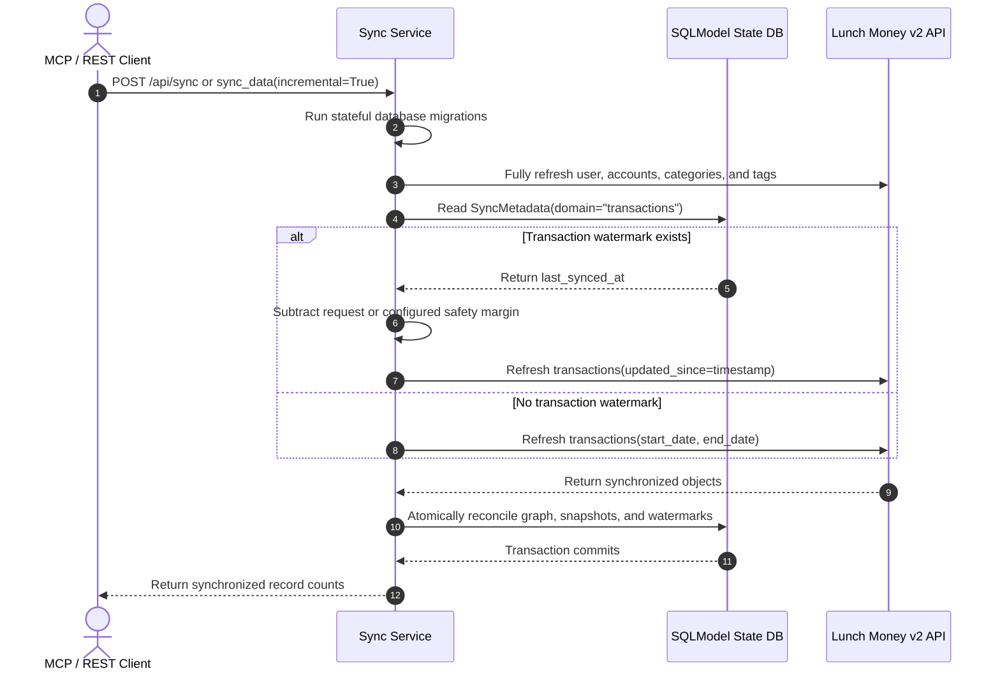

# 🔄 Incremental ETL Architecture & Sync Specification

## 📋 Overview

This document describes the delivered Sprint 0 **opt-in incremental transaction pipeline** for **Lunch Money MCP**. Transaction synchronization can resume from a UTC watermark with a configurable overlap, while user, account, category, and tag data continue to refresh in full. The default rolling transaction date window (`days=30`) and persistent SQLite storage remain unchanged unless the caller explicitly opts in.

---

## 🏛️ Directives & Key Design Decisions

> [!IMPORTANT]
> **1. Incremental Transaction Sync is Opt-In**:
>
> - Default behavior for `POST /api/sync` and `sync_data` FastMCP tool: `incremental: bool = False`.
> - When `incremental=False`, transactions use the standard rolling date window from `days: int = 30` (or explicit service-layer `start_date` / `end_date`) and replace the projection only inside that authoritative window. Historical rows outside it are preserved.
> - When `incremental=True`, only transactions consult `SyncMetadata(domain="transactions")`. An existing watermark produces `updated_since = last_synced_at - timedelta(minutes=safety_margin)`; a missing watermark falls back to the standard date window.
> - User, Plaid account, manual account, category, and tag refreshes are full refreshes in both modes.

> [!IMPORTANT]
> **2. Parameterized Safety Overlap Window**:
>
> - `safety_margin_minutes` is available on both transports and overrides the configured value for that request.
> - When the override is omitted, `LUNCHMONEY_SYNC_SAFETY_MARGIN_MINUTES` supplies the value (default `5` minutes).

> [!IMPORTANT]
> **3. Watermarks Advance Only After Successful Persistence**:
>
> - Incremental execution captures a UTC start time and commits the normalized graph, response snapshots, and watermarks in one database transaction. Any persistence failure rolls all three back.
> - Complete metadata snapshots reconcile deletions for users, accounts, categories, and tags. Date-bounded recurring responses update returned definitions without deleting definitions that may fall outside the requested window.
> - Incremental transaction responses never delete absent rows because an `updated_since` response is not a complete collection. Scheduled transaction work performs an authoritative rolling-window refresh at least daily and uses incremental refreshes between those reconciliations.
> - Synchronization batch-prefetches existing category and transaction graphs, avoiding one eager graph query per incoming record.
> - Every interactive and scheduled synchronization acquires the shared migration/sync lock in the service layer without blocking the asyncio event loop. Scheduled work uses nonblocking acquisition and records a skipped result when another worker owns the lock.
> - Redis-backed synchronization locks renew their lease throughout long-running work, so a sync that exceeds the initial TTL remains exclusive. File locks remain owned until explicit release.

> [!NOTE]
> **4. Synchronization Requires Stateful Mode**:
>
> - `LUNCHMONEY_PERSISTENCE_MODE=stateful` enables synchronization, watermarks,
>   migrations, and scheduling.
> - Ephemeral mode has no database and rejects sync and scheduler operations with
>   `stateful_mode_required`.

> **6. Recurring Matches Are Period Snapshots**:
>
> - Recurring definitions are persisted by ID, and each synchronization window retains its complete upstream match payload under a period-specific cache key.
> - The same payload is retained as the latest snapshot for recurring reads without an explicit period.
> - This preserves expected, found, and missing occurrence details, while preventing one synchronization window from being reused for another.
> - A period snapshot is not treated as a globally authoritative recurring-definition list; definitions absent from one bounded window remain available for other windows.

---

## System Architecture & Flow



---

## 🛠️ Code Specifications

### Configuration (`src/lunchmoney_app/config.py`)

```python
    model_config = SettingsConfigDict(env_prefix="LUNCHMONEY_")

    persistence_mode: Literal["stateful", "ephemeral"] = "stateful"
    sync_safety_margin_minutes: int = 5
```

Database configuration is valid only in stateful mode. The HTTP default is
stateful; MCP stdio defaults to ephemeral when the mode is omitted.

### Transport Interfaces

```text
POST /api/sync?days=30&incremental=true&safety_margin_minutes=5
```

```python
sync_data(
    days: int = 30,
    incremental: bool = False,
    safety_margin_minutes: int | None = None,
) -> SyncResult
```

The FastAPI router and FastMCP tool are pure delegators: both forward all three controls unchanged to the shared synchronization services.

### Database Model (`src/lunchmoney_app/database/models/sync.py`)

```python
class SyncMetadata(SQLModel, table=True):
    __tablename__ = "sync_metadata"

    domain: str = Field(primary_key=True)
    last_synced_at: datetime = Field(sa_type=UTCDateTime())
```

`domain` is the natural primary key, and timestamps are normalized to timezone-aware UTC during model initialization and database round trips. Sprint 0 creates and reads only the `transactions` domain; the schema remains domain-keyed for future incremental coverage without claiming that those domains are currently implemented.
